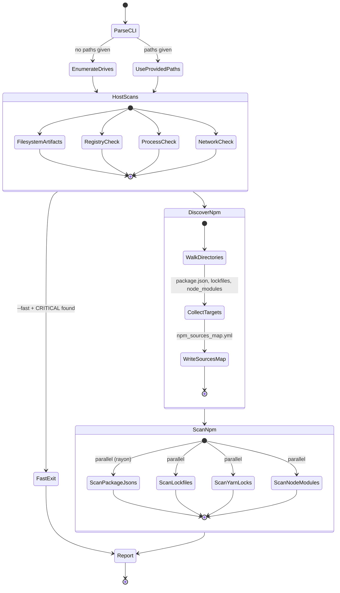

# Design — axios-rat-scan

## Purpose

A single cross-platform Rust binary that scans all mounted drives for evidence of the axios supply chain RAT (disclosed 2026-03-31). Designed for incident responders and developers who need a fast, zero-dependency answer to "am I affected?"

## Architecture

```
main.rs              CLI entry, drive enumeration, progress UI (indicatif)
iocs.rs              All IOC constants (hashes, versions, paths, domains, process patterns)
report.rs            Finding model, severity levels, tree view, text/JSON output
scanner/
  filesystem.rs      Platform-specific RAT artifact + SHA-256 hash verification
  npm.rs             package.json / lockfile / yarn.lock / node_modules scanning
  registry.rs        Windows registry persistence + script-in-temp detection (cfg(windows))
  process.rs         Process inspection: parent-child chains, renamed binaries, C2 UA
  network.rs         TCP connections, DNS cache inspection, hosts file tampering
test/
  Dockerfile         Multi-stage: Rust build + VHS base + 100-project IOC scaffold
  scaffold.sh        Creates ~100 realistic npm projects with 4 infected
  verify.sh          22 integration tests + optional GIF recording
  demo.tape          VHS tape for terminal recording
```

## Scan Flow



## Two-Phase Discovery + Scan

1. **Discovery** — single `walkdir` pass collects all `package.json`, lockfiles, `yarn.lock`, and `node_modules` paths. Also builds the `npm_sources_map.yml` inventory. This avoids redundant filesystem walks.

2. **Scan** — all discovered targets are scanned in parallel via `rayon`. Each scan function is pure (takes a path, returns findings) making it trivially parallelizable.

## Cross-Platform Strategy

| Concern | Windows | macOS | Linux |
|---|---|---|---|
| Drive enumeration | A:-Z: drive letters | `/` + `/Volumes/*` | `/proc/mounts` |
| RAT artifacts | `wt.exe`, `system.bat`, `6202033.vbs/ps1` | `com.apple.act.mond`, `*.scpt` | `/tmp/ld.py` |
| Persistence | Registry Run key (`MicrosoftUpdate`) | — | — |
| Process detection | Renamed PowerShell, `-ep Bypass` flags | `osascript` dropper, `com.apple.act.mond` | `python /tmp/ld.py` |
| Process chains | node -> shell -> curl/wget (Elastic rule) | node -> osascript chain | node -> bash -> curl chain |
| Network | `netstat -n -o` + `ipconfig /displaydns` | `netstat -tnp` + mdnsresponder log | `netstat -tnp` / `ss -tnp` + resolvectl |
| Hosts file | `C:\Windows\System32\drivers\etc\hosts` | `/etc/hosts` | `/etc/hosts` |

Platform-specific code uses `#[cfg(windows)]` / `#[cfg(target_os = "...")]` compile gates — no runtime feature detection, no dead code on each platform.

## Elastic Detection Rule Coverage

Detection rules from [Elastic Security Labs](https://www.elastic.co/security-labs/axios-supply-chain-compromise-detections) implemented in the scanner:

| Elastic Rule | Scanner Module | How |
|---|---|---|
| Curl or Wget Spawned via Node.js | `process.rs` | Parent-child chain: node -> shell -> curl/wget |
| Process Backgrounded by Unusual Parent | `process.rs` | Shell `-c ... &` with node parent |
| Execution via Renamed Signed Binary Proxy | `process.rs` + `filesystem.rs` | `wt.exe` in ProgramData, non-PowerShell with `-ep Bypass` |
| Suspicious URL as argument to Self-Signed Binary | `process.rs` | macOS `osascript` with shell commands |
| Suspicious String Value Written to Registry Run Key | `registry.rs` | `MicrosoftUpdate`, `system.bat`, `wt.exe` in Run key |
| Startup Persistence via Windows Script Interpreter | `registry.rs` | `.vbs`/`.bat`/`.ps1` in Run key from temp/ProgramData paths |

## Performance

- **walkdir** for fast recursive traversal with `filter_entry` to prune early
- **rayon** for parallel scanning of all discovered targets
- **indicatif** for live progress spinners + bars during scanning
- `node_modules` directories are not recursed — only checked for specific malicious packages at the top level
- SHA-256 hashing is only performed on files that match known artifact paths/names
- Skip list prunes `.git`, `Windows`, `System Volume Information`, `$RECYCLE.BIN`
- Discovery tree prints before scanning so user can inspect found projects

## Output Modes

- **Text** (default): colored tree view, animated progress, severity tags, remediation steps
- **JSON** (`--json`): array of finding objects for pipeline integration
- **npm_sources_map.yml**: YAML inventory of all discovered npm projects

## Testing

Docker integration tests (`task test`):
- Multi-stage build compiles Linux binary in `rust:1-bookworm`, runs in VHS container
- Scaffolds ~100 realistic npm projects across 5 org types with 4 infected
- 22 assertions covering host artifacts, all npm IOC categories, false positives, exit codes
- Optional GIF recording of scan output via VHS

## Exit Codes

- `0` — no critical findings
- `1` — one or more critical findings detected
